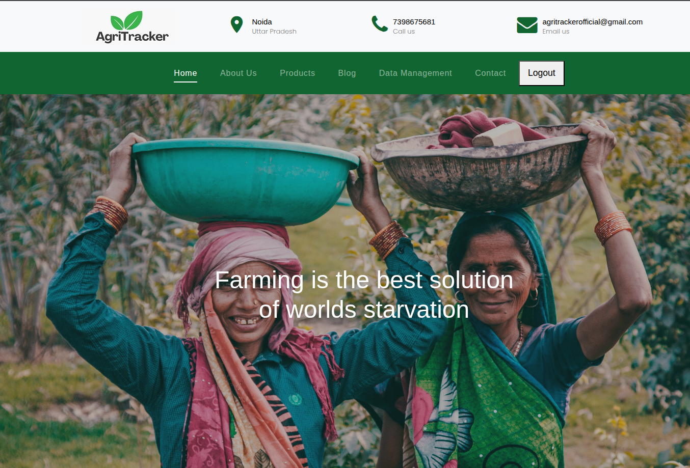
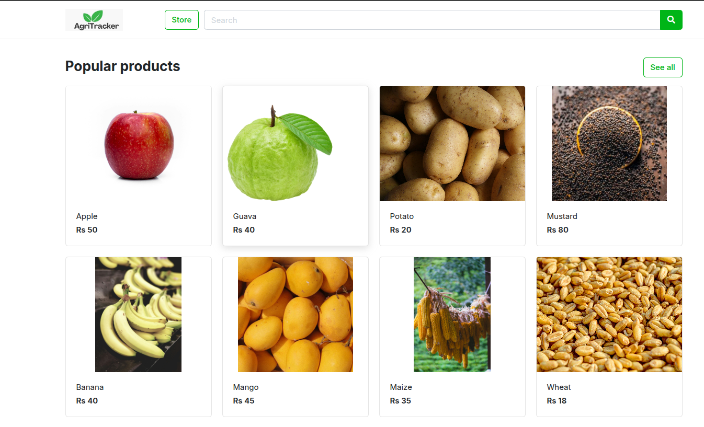
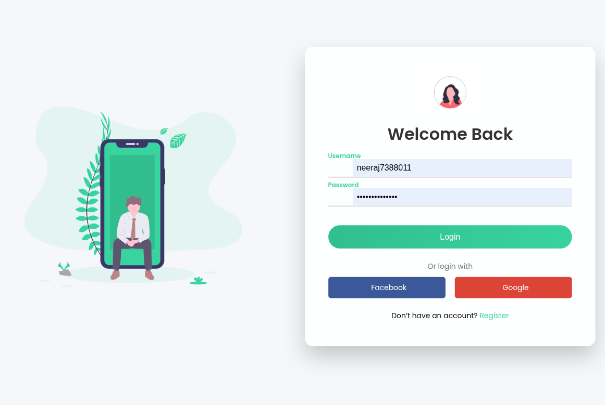
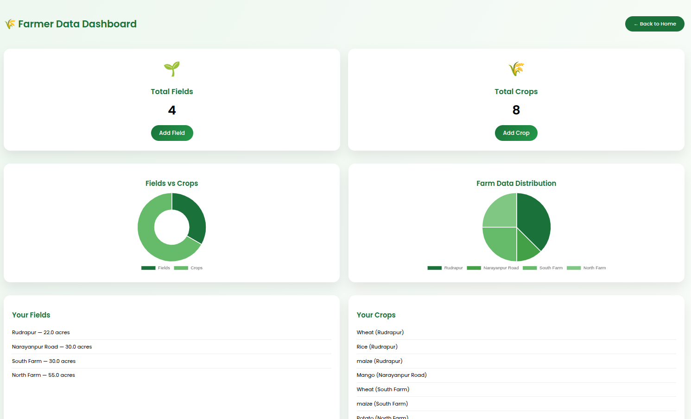

# 🌾 AgriTracker

**Version**: 1.0  
**Prepared by**: Neeraj Ku. Kannoujiya, Aman Sahu  
**Approved by**: Dr. Gaurav Srivastava  
**Date**: 06/04/2025  

---

## 📌 Overview

**AgriTracker** is a web-based agricultural management and marketplace platform built specifically for **Large and Mid-scale farmers in India**. It offers digital farm record-keeping, a direct-to-buyer marketplace, and a blog-based knowledge-sharing community for farmers deployed on AWS EC2. 

It aims to bridge gaps in data management, reduce dependence on middlemen, and enhance sustainability in Indian agriculture.

---

## 🧠 Purpose

This repository hosts the source code and configuration for the **AgriTracker** platform. It includes:

- Backend & API development using Django REST Framework  
- A responsive frontend using Bootstrap and Django templates  
- SQLite for farm data storage  
- Marketplace functionality for connecting farmers and buyers  
- A blog for agricultural knowledge exchange  

---

## 🎯 Objectives

| Objective             | Description                                     |
|-----------------------|-------------------------------------------------|
| Data-Driven Decisions | Record and analyze farm operations              |
| Market Linkage        | Enable direct farmer-to-buyer connections       |
| Sustainability        | Promote efficient resource usage                | 

---

## 🧩 Features

### ✅ Phase 1 (In Scope)
- 👨‍🌾 **Farm Management**
  - Crop cycle & season tracking
  - Resource input logging (e.g., water, fertilizers)
  - Auto-generated reports (PDF/Excel)
-   

- 🛒 **Marketplace**
  - Farmers can list products (type, quantity, price)
  - Buyers can search and filter listings
  - Communication via WhatsApp or phone
- 

- 📝 **Blog & Knowledge Sharing**
  - Publish experiences and farming techniques
  - Share profit/loss case studies
  - Recommend pesticides and insecticides
-   

### 🚫 Out of Scope (Future Phases)
- Online payment integration  
- AI/ML-driven analytics and predictive insights  

---

## 👥 Intended Audience

| Role                 | Usage Purpose                     |
|----------------------|-----------------------------------|
| Developers           | System architecture, implementation |
| Testers              | Validation, bug fixing            |
| Project Managers     | Timeline/resource tracking        |
| Farmers (End Users)  | Day-to-day platform usage         |
| Agricultural Orgs    | Impact evaluation & feedback      |

---

## 🛠️ Tech Stack

| Layer      | Technology                                |
|------------|--------------------------------------------|
| Frontend   | HTML5, CSS3, Bootstrap, JavaScript         |
| Backend    | Python 3.x, Django, Django REST Framework  |
| Database   | DBSqlite3              |
| Testing    | PyTest, UAT (User Acceptance Testing)      |
| Deployment | Amazon AWS EC2       |

---

## 🌀 Project ScreenShots

> 📌 *Add your screenshots in the `screenshots/` folder and update the file names if required.*

---

### 🏠 Landing Page
<!-- PLACE LANDING PAGE SCREENSHOT BELOW -->


**Description:**  
The landing page introduces AgriTracker’s mission and key features, providing users with an overview of farm management and marketplace services through a simple and responsive interface.

---

### 🛒 Products Page
<!-- PLACE PRODUCTS PAGE SCREENSHOT BELOW -->


**Description:**  
The products page allows users to browse agricultural products by category, search items, view pricing, and access detailed product information.

---

### 🔐 Login Page
<!-- PLACE LOGIN PAGE SCREENSHOT BELOW -->


**Description:**  
The login page provides secure authentication for farmers and users, enabling access to personalized dashboards and farm-related functionalities.

---

### 📊 Data Store Page
<!-- PLACE DATA STORE PAGE SCREENSHOT BELOW -->


**Description:**  
The data store page enables farmers to manage and store farm data such as crop details, field information, and operational records in an organized manner.

---


---


## 📁 Project Structure

```bash
agritracker/
├── agritracker/           # Django settings and routing
├── farm/                  # Farm management app
├── marketplace/           # Produce marketplace app
├── blog/                  # Farmer blog & community sharing
├── templates/             # HTML templates
├── static/                # CSS, JS, and image assets
├── manage.py
├── requirements.txt
└── README.md
```


---

## 🧰 Prerequisites

Make sure you have the following installed on your system:

- ✅ Python 3.8 or higher  
- ✅ pip (Python package manager)  
- ✅ PostgreSQL (recommended) or SQLite (for local development)  
- ✅ Git

---

## 🚀 Local Setup Steps

```bash
# 1. Clone the Repository
git clone https://github.com/your-username/agritracker.git
cd agritracker

# 2. Create a Virtual Environment
python3 -m venv venv
source venv/bin/activate           # Windows: venv\Scripts\activate

# 3. Install Dependencies
pip install -r requirements.txt

# 4. Set Up the Database
# This will create the necessary tables
python manage.py makemigrations
python manage.py migrate

# 5. Create a Superuser for Admin Access
python manage.py createsuperuser

# 6. Run the Development Server
python manage.py runserver

```

🖥️ Open in your browser: http://127.0.0.1:8000

